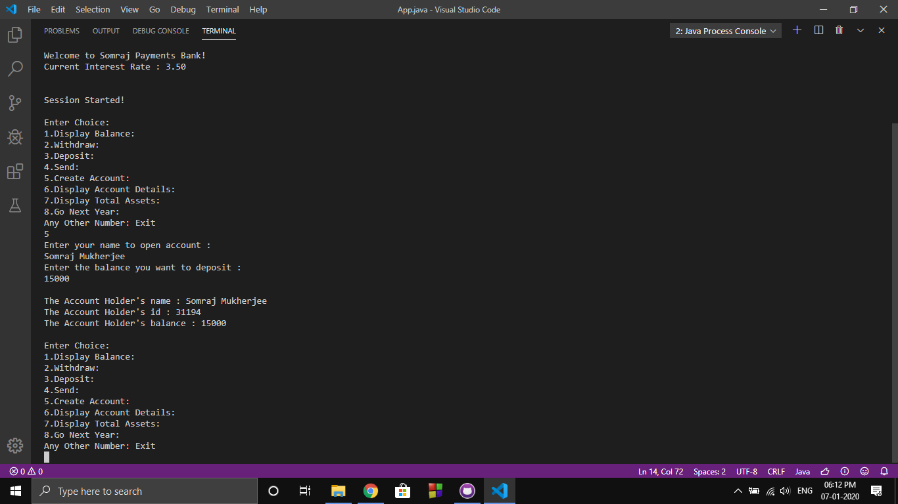

# Banking System Using Java

Banking System Using Java is a simple and basic banking system which has basic functionalities. I am doing this for a friend of mine. This is not done yet. Will update in future.

## Run Online

## Image

## Features

1. Display Balance
2. Withdraw Balance
3. Deposit Balance
4. Create New Account
5. Sending Money From One Account to Another
6. Display Account Details
7. Updating Accounts Considering Interest
8. Displaying Total Bank Assets

## Developer

LinkedIn : [iamsomraj](https://www.linkedin.com/in/iamsomraj/) 😊

HackerRank: [iamsomraj](https://www.hackerrank.com/iamsomraj?hr_r=1) 😊

## Show Your Support

Give me a star ⭐

if this project helped you 👦 👧

## Contributing

Pull requests are welcome. 🤝 For major changes, please open an issue first to discuss what you would like to change. 🙏

Please make sure to update tests as appropriate. ✌

## License

[MIT](https://choosealicense.com/licenses/mit/) 📰